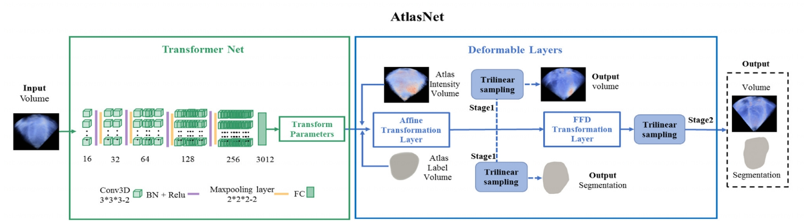

# AtlasNet

This repository is the official implementation of ***Deep Atlas Network for Efficient 3D Left Ventricle Segmentation on Echocardiography*** which is presented at Medical Image Analysis 2020.

[[paper](https://www.sciencedirect.com/science/article/abs/pii/S1361841520300050)][[code](https://github.com/PerceptionComputingLab/atlasnet)]

## Set up the the environment
```
conda env create -n atlasnet -f atlasnet.yaml
conda activate atlasnet
```

## Data
In our experiments, we used the following dataset:
* CETUS: [CETUS](https://www.creatis.insa-lyon.fr/Challenge/CETUS/databases.html)


We use the CETUS dataset in our code, and the image size was changed to 128x128x128.

In the folder ./CETUS, we use some examples to show the format of the data.

## Config

To change the default config, modify this file: [config](./Model/config.py)

## Training

To train our model, run this command: 

```train
python train.py
```
## Test

To test the trained our model, run:

```eval
python test.py
```

## Citation

```    
@inproceedings{DONG2020101638,
  title={Deep Atlas Network for Efficient 3D Left Ventricle Segmentation on Echocardiography},
  author={Suyu Dong and Gongning Luo and Clara Tam and Wei Wang and Kuanquan Wang and Shaodong Cao and Bo Chen and Henggui Zhang and Shuo Li},
  journal = {Medical Image Analysis},
  volume = {61},
  pages = {101638},
  year = {2020},
  issn = {1361-8415},
}
```
